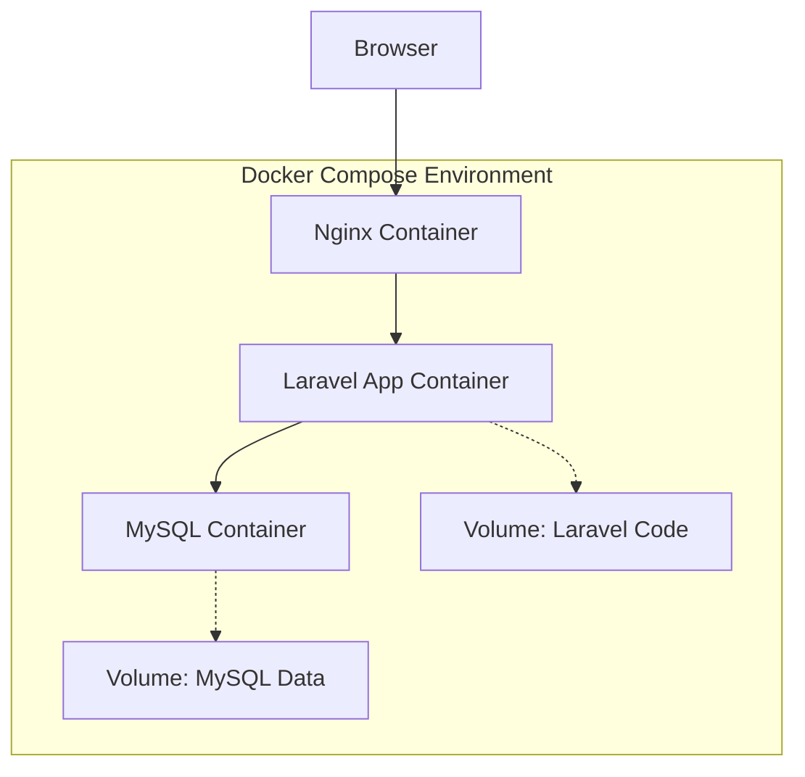

# Design Document

## Overview

「丘の城 ロジカ亭」旅館の公式ウェブサイトは、Laravel 12.x、MySQL 8.4、Docker Composeを使用したモダンなウェブアプリケーションとして設計されます。初期段階では静的なTOPページを提供し、将来的な機能拡張に備えた拡張可能なアーキテクチャを採用します。

## Architecture

### System Architecture



### Container Architecture

1. **Nginx Container**: リバースプロキシとして動作し、静的ファイルの配信とPHPリクエストのルーティングを担当
2. **Laravel App Container**: PHP-FPMでLaravelアプリケーションを実行
3. **MySQL Container**: データベースサーバー（将来の動的機能用）

### Directory Structure

```
ryokan-website/
├── docker-compose.yml
├── docker/
│   ├── nginx/
│   │   └── default.conf
│   └── php/
│       └── Dockerfile
├── src/                    # Laravel application root
│   ├── app/
│   ├── resources/
│   │   └── views/
│   │       ├── layouts/
│   │       │   └── app.blade.php
│   │       └── welcome.blade.php
│   ├── public/
│   │   ├── css/
│   │   ├── js/
│   │   └── images/
│   └── routes/
│       └── web.php
└── .env
```

## Components and Interfaces

### Docker Configuration

#### docker-compose.yml
- **Services**: nginx, app (Laravel), mysql
- **Networks**: Internal network for container communication
- **Volumes**: Code synchronization and database persistence
- **Environment Variables**: Database credentials, Laravel configuration

#### Nginx Configuration
- **Port Mapping**: 80:80 for HTTP access
- **Document Root**: `/var/www/html/public`
- **PHP-FPM Integration**: FastCGI proxy to Laravel container

#### Laravel Container
- **Base Image**: php:8.4-fpm
- **Extensions**: PDO, MySQL, GD, Zip, etc.
- **Composer**: For dependency management
- **Working Directory**: `/var/www/html`

### Laravel Application Structure

#### Routes (web.php)
```php
Route::get('/', function () {
    return view('welcome');
});
```

#### Blade Templates

**Layout Template (layouts/app.blade.php)**
- HTML5 doctype and meta tags
- Responsive viewport configuration
- CSS and JavaScript asset inclusion
- Header, main content area, footer structure
- Japanese language support (lang="ja")

**Welcome Template (welcome.blade.php)**
- Extends the main layout
- Static content sections:
  - Hero section with ryokan name and catchphrase
  - Facility highlights
  - Location information
  - Contact information

### Static Assets

#### CSS Structure
- **main.css**: Core styling and layout
- **responsive.css**: Mobile-first responsive design
- **components.css**: Reusable component styles

#### JavaScript
- **main.js**: Basic interactions and animations
- **No framework dependencies**: Pure JavaScript for simplicity

#### Images
- **Hero images**: High-quality ryokan exterior/interior photos
- **Facility images**: Room types, dining, amenities
- **Optimized formats**: WebP with JPEG fallbacks

## Data Models

### Current Phase (Static)
No database models required for the initial static implementation.

### Future Considerations
- Room model (room types, availability, pricing)
- Reservation model (booking management)
- Guest model (customer information)
- Facility model (amenities, services)

## Error Handling

### Development Environment
- **Laravel Debug Mode**: Enabled in local environment
- **Error Logging**: Laravel log files in storage/logs
- **Docker Logs**: Container-specific logging via docker-compose logs

### Production Readiness
- **Error Pages**: Custom 404, 500 error pages
- **Graceful Degradation**: Fallback for missing assets
- **Health Checks**: Container health monitoring

## Testing Strategy

### Static Content Testing
- **Browser Testing**: Cross-browser compatibility (Chrome, Firefox, Safari, Edge)
- **Responsive Testing**: Mobile, tablet, desktop viewports
- **Performance Testing**: Page load times, asset optimization
- **Accessibility Testing**: WCAG 2.1 compliance

### Infrastructure Testing
- **Container Orchestration**: Docker Compose up/down cycles
- **Volume Persistence**: Data persistence across container restarts
- **Network Connectivity**: Inter-container communication
- **Environment Configuration**: .env file loading and variable access

### Code Quality
- **PHP Standards**: PSR-12 coding standards
- **Blade Template Validation**: Syntax and structure validation
- **Asset Optimization**: CSS/JS minification and compression

## Security Considerations

### Development Environment
- **Container Isolation**: Proper network segmentation
- **File Permissions**: Appropriate ownership and permissions
- **Environment Variables**: Secure credential management

### Application Security
- **CSRF Protection**: Laravel's built-in CSRF middleware (for future forms)
- **XSS Prevention**: Blade template auto-escaping
- **Secure Headers**: Content Security Policy, X-Frame-Options

## Performance Optimization

### Static Asset Delivery
- **Nginx Static File Serving**: Direct serving of CSS, JS, images
- **Gzip Compression**: Text-based asset compression
- **Browser Caching**: Appropriate cache headers

### Laravel Optimization
- **Config Caching**: Laravel configuration optimization
- **Route Caching**: Route definition caching
- **View Caching**: Blade template compilation caching

## Deployment Configuration

### Local Development
- **Hot Reload**: File watching for immediate changes
- **Debug Tools**: Laravel Telescope (optional)
- **Database Seeding**: Sample data for development

### Environment Variables
```
APP_NAME="丘の城 ロジカ亭"
APP_ENV=local
APP_DEBUG=true
APP_URL=http://localhost

DB_CONNECTION=mysql
DB_HOST=mysql
DB_PORT=3306
DB_DATABASE=ryokan_website
DB_USERNAME=ryokan_user
DB_PASSWORD=secure_password
```