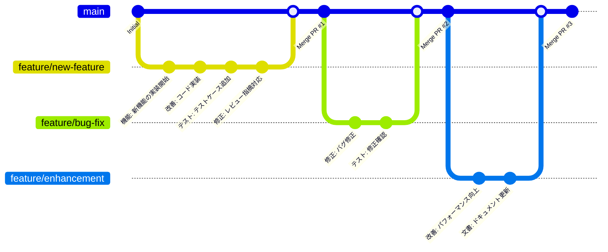

# 丘の城 ロジカ亭 - 旅館ウェブサイト


「丘の城 ロジカ亭」は、美しい自然に囲まれた心安らぐ和の宿のウェブサイトです。Laravel 12.x + Docker 環境で構築された、完全レスポンシブ対応の旅館予約サイトです。

## 📋 目次

- [プロジェクト概要](#プロジェクト概要)
- [技術スタック](#技術スタック)
- [環境構築](#環境構築)
- [使用方法](#使用方法)
- [開発ガイド](#開発ガイド)
- [プロジェクト構成](#プロジェクト構成)
- [機能一覧](#機能一覧)
- [トラブルシューティング](#トラブルシューティング)
- [貢献方法](#貢献方法)

## 🏯 プロジェクト概要

このプロジェクトは、日本の伝統的な旅館「丘の城 ロジカ亭」のウェブサイトです。以下の特徴があります：

- **完全レスポンシブデザイン**: モバイル、タブレット、デスクトップに対応
- **モダンなフロントエンド**: CSS Grid、Flexbox、JavaScript ES6+
- **Laravel 12.x**: 最新の PHP フレームワーク
- **Docker 環境**: 簡単な環境構築とデプロイ
- **アクセシビリティ対応**: WCAG 準拠のユーザビリティ

## 🛠 技術スタック

### バックエンド

- **Laravel**: 12.21.0
- **PHP**: 8.4.10
- **MySQL**: 8.4

### フロントエンド

- **HTML5**: セマンティックマークアップ
- **CSS3**: Grid、Flexbox、カスタムプロパティ
- **JavaScript**: ES6+、モジュール化

### インフラ・ツール

- **Docker**: コンテナ化
- **Docker Compose**: マルチコンテナ管理
- **Nginx**: Web サーバー
- **Git**: バージョン管理

## 🚀 環境構築

### 前提条件

以下のソフトウェアがインストールされている必要があります：

- **Docker Desktop**: [公式サイト](https://www.docker.com/products/docker-desktop/)からダウンロード
- **Git**: [公式サイト](https://git-scm.com/)からダウンロード
- **テキストエディタ**: VS Code、PhpStorm 等

### 1. リポジトリのクローン

```bash
# HTTPSでクローン
git clone https://github.com/logicalAnd-Inc/2508-intern.git

# SSHでクローン（推奨）
git clone git@github.com:logicalAnd-Inc/2508-intern.git

# プロジェクトディレクトリに移動
cd 2508-intern
```

### 2. 環境ファイルの設定

```bash
# Laravel用の環境ファイルをコピー
cp src/.env.example src/.env
```

### 3. Docker 環境の起動

```bash
# Docker Composeでコンテナを起動（初回は時間がかかります）
docker compose up -d

# ログを確認（オプション）
docker compose logs -f
```

### 4. Laravel 依存関係のインストール

```bash
# Composerで依存関係をインストール
docker compose exec app composer install

# アプリケーションキーを生成
docker compose exec app php artisan key:generate
```

### 5. 動作確認

ブラウザで以下の URL にアクセス：

```
http://localhost
```

「丘の城 ロジカ亭」のウェブサイトが表示されれば成功です！

## 📱 使用方法

### 基本操作

1. **サイト閲覧**: http://localhost でメインサイトにアクセス
2. **レスポンシブテスト**: ブラウザの開発者ツールでデバイスエミュレーション
3. **ログ確認**: `docker compose logs app` でアプリケーションログを表示

### 開発サーバーの管理

```bash
# コンテナ起動
docker compose up -d

# コンテナ停止
docker compose down

# コンテナ再起動
docker compose restart

# 特定のコンテナのみ再起動
docker compose restart app
```

### データベース操作

```bash
# MySQLコンテナに接続
docker compose exec mysql mysql -u root -p

# マイグレーション実行
docker compose exec app php artisan migrate

# シーダー実行
docker compose exec app php artisan db:seed
```

## 🔧 開発ガイド

### ファイル編集

プロジェクトファイルを編集すると、リアルタイムで変更が反映されます：

- **PHP/Blade**: `src/` ディレクトリ内のファイル
- **CSS**: `src/public/css/main.css`
- **JavaScript**: `src/public/js/main.js`

### Artisan コマンド

```bash
# コントローラー作成
docker compose exec app php artisan make:controller ExampleController

# モデル作成
docker compose exec app php artisan make:model Example

# マイグレーション作成
docker compose exec app php artisan make:migration create_examples_table

# ルート一覧表示
docker compose exec app php artisan route:list
```

### テスト実行

```bash
# PHPUnitテスト実行
docker compose exec app php artisan test

# 特定のテストファイル実行
docker compose exec app php artisan test tests/Feature/ExampleTest.php
```

## 📁 プロジェクト構成

```
2508-intern/
├── docker/                    # Docker設定ファイル
│   ├── nginx/
│   │   └── default.conf      # Nginx設定
│   └── php/
│       └── Dockerfile        # PHP-FPM設定
├── src/                      # Laravelアプリケーション
│   ├── app/                  # アプリケーションロジック
│   ├── config/               # 設定ファイル
│   ├── database/             # マイグレーション・シーダー
│   ├── public/               # 公開ファイル
│   │   ├── css/
│   │   │   └── main.css     # メインスタイルシート
│   │   └── js/
│   │       └── main.js      # メインJavaScript
│   ├── resources/            # ビューファイル
│   │   └── views/
│   │       ├── layouts/
│   │       │   └── app.blade.php
│   │       └── welcome.blade.php
│   └── routes/               # ルート定義
├── .kiro/                    # 仕様書・設計書
│   └── specs/
│       └── ryokan-website/
├── docker-compose.yml        # Docker Compose設定
├── .gitignore               # Git除外ファイル
└── README.md                # このファイル
```

## ✨ 機能一覧

### 🏠 フロントエンド機能

- **レスポンシブデザイン**: 全デバイス対応
- **モバイルナビゲーション**: ハンバーガーメニュー
- **スムーススクロール**: アンカーリンク対応
- **アニメーション**: Intersection Observer 使用
- **アクセシビリティ**: ARIA 属性、キーボードナビゲーション

### 🏯 コンテンツ

- **ヒーローセクション**: メインビジュアルとキャッチコピー
- **施設案内**: 温泉、客室、お食事、庭園の詳細
- **お知らせ**: 最新情報とイベント告知
- **アクセス情報**: 交通案内と周辺観光地
- **お問い合わせ**: 連絡先とチェックイン情報

### 🔧 技術機能

- **Laravel 12.x**: 最新フレームワーク
- **Docker 環境**: 簡単デプロイ
- **クロスブラウザ対応**: Chrome、Firefox、Safari、Edge
- **SEO 最適化**: メタタグ、構造化データ

## 🐛 トラブルシューティング

### よくある問題と解決方法

#### 1. Docker が起動しない

```bash
# Docker Desktopが起動しているか確認
docker --version

# Docker Desktopを再起動
# macOS: アプリケーション → Docker Desktop → 再起動
# Windows: タスクトレイ → Docker Desktop → Restart
```

#### 2. ポート 3306 が使用中

```bash
# MySQLが既に起動している場合
sudo lsof -i :3306

# 既存のMySQLを停止
sudo brew services stop mysql  # macOS
sudo systemctl stop mysql     # Linux
```

#### 3. 権限エラー

```bash
# ファイル権限を修正
sudo chown -R $USER:$USER src/storage
sudo chmod -R 775 src/storage
```

#### 4. Composer エラー

```bash
# Composerキャッシュをクリア
docker compose exec app composer clear-cache

# 依存関係を再インストール
docker compose exec app composer install --no-cache
```

### ログの確認方法

```bash
# 全コンテナのログ
docker compose logs

# 特定のコンテナのログ
docker compose logs app
docker compose logs nginx
docker compose logs mysql

# リアルタイムログ
docker compose logs -f app
```

## 🤝 貢献方法

### 開発フロー

1. **Issue の確認**: 既存の課題を確認
2. **ブランチ作成**: `feature/your-feature-name`
3. **開発**: 機能実装・テスト
4. **Pull Request**: レビュー依頼
5. **マージ**: 承認後に main ブランチへ

#### ブランチ運用図



#### ブランチ命名規則

| ブランチタイプ | 命名例                        | 用途             |
| -------------- | ----------------------------- | ---------------- |
| `feature/`     | `feature/user-authentication` | 新機能開発       |
| `fix/`         | `fix/login-bug`               | バグ修正         |
| `improvement/` | `improvement/performance`     | 既存機能改善     |
| `docs/`        | `docs/readme-update`          | ドキュメント更新 |
| `test/`        | `test/unit-tests`             | テスト追加       |

### コーディング規約

- **PHP**: PSR-12 準拠
- **JavaScript**: ES6+、セミコロン必須
- **CSS**: BEM 記法推奨
- **コミット**: Conventional Commits 形式

### テスト

```bash
# 全テスト実行
docker compose exec app php artisan test

# レスポンシブテスト
node test-responsive.js
```

### GitHub CLI Pull Request 自動作成

```bash
# 自動Pull Request作成（推奨）
./scripts/kiro-pr-helper.sh auto

# カスタムタイトルでPull Request作成
./scripts/kiro-pr-helper.sh custom "機能: 新機能追加" "詳細な説明"

# 下書きPull Request作成
./scripts/kiro-pr-helper.sh draft

# 詳細なPull Request作成
./scripts/create-pr.sh feature/branch-name "機能: タイトル" "説明"

# ヘルプ表示
./scripts/kiro-pr-helper.sh help
```

## 📞 サポート

### 連絡先

- **Issues**: [GitHub Issues](https://github.com/logicalAnd-Inc/2508-intern/issues)
- **Discussions**: [GitHub Discussions](https://github.com/logicalAnd-Inc/2508-intern/discussions)

### 参考資料

- [Laravel 12.x ドキュメント](https://laravel.com/docs/12.x)
- [Docker Compose ドキュメント](https://docs.docker.com/compose/)
- [レスポンシブデザインガイド](responsive-verification.md)

---

## 📄 ライセンス

このプロジェクトは [MIT License](LICENSE) の下で公開されています。

---

**Happy Coding! 🚀**

_最終更新: 2025 年 9 月 21 日_
